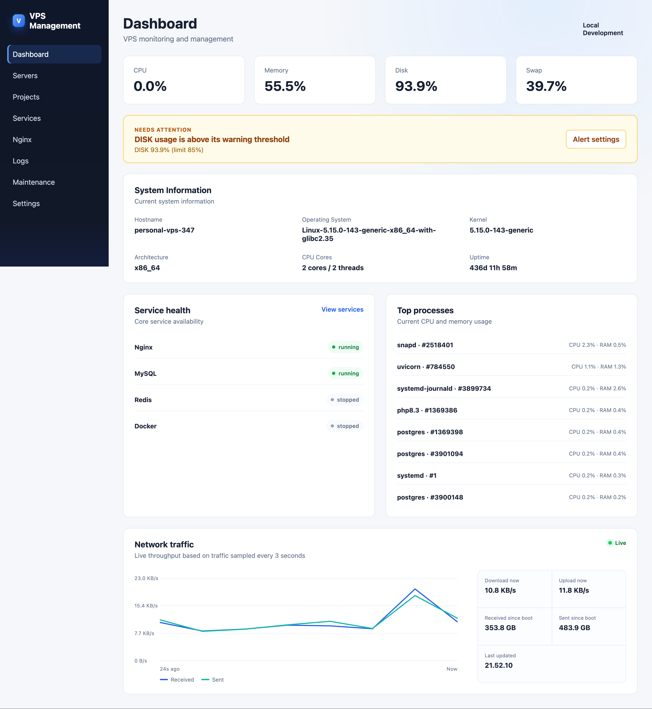
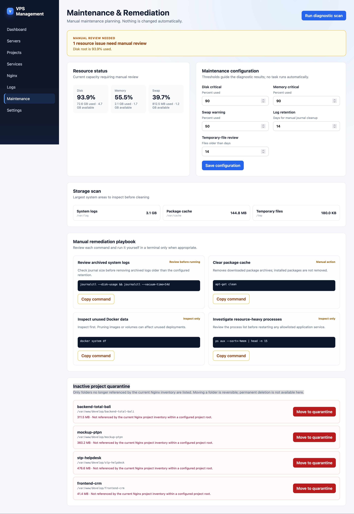

# VPS Management

A FastAPI dashboard for observing a Linux VPS, its Nginx projects, essential services, and manual maintenance tasks. It is intended for sysadmins, DevOps engineers, and developers who need a lightweight, self-hosted operational view of a server.

> **Safety first:** maintenance is manual. The application does not schedule cleanup, restart services, or permanently delete projects automatically.

## Preview





[](docs/assets/vps-management-demo.mov)

The linked screen recording shows the interactive workflow.

## Features

- Live CPU, memory, disk, swap, uptime, service, and top-process monitoring.
- Short-horizon live network throughput chart for received and sent traffic.
- Nginx server-block inventory with domains, SSL state, roots, and proxy targets.
- Project workspace with search, filters, grid/list views, Git metadata, and project details.
- Protected Maintenance & Remediation area with manual diagnostics, storage scan, and copyable command playbooks.
- Configurable alert thresholds for disk, memory, swap, and maintenance review windows.
- Admin-only, reversible **project quarantine** for candidate directories not referenced by the current Nginx inventory.
- Responsive drawer navigation and touch-friendly layouts for mobile devices.

## Requirements

- Linux host with Python 3.10+.
- Nginx is optional, but required for automatic project and server-block discovery.
- `systemd` is recommended for production operation.
- Root or appropriate read permissions for host diagnostics. Run only on hosts you administer.

## Quick start: native deployment

```bash
git clone https://github.com/codesyariah122/vps-management.git
cd vps-management
python3 -m venv venv
./venv/bin/pip install -r requirements.txt
./venv/bin/uvicorn app.main:app --host 127.0.0.1 --port 8000
```

Place Nginx or another TLS reverse proxy in front of `127.0.0.1:8000`. Do not expose Uvicorn directly to the internet.

### systemd service

Create `/etc/systemd/system/vps-management.service`:

```ini
[Unit]
Description=VPS Management FastAPI
After=network.target

[Service]
Type=simple
User=root
Group=root
WorkingDirectory=/var/www/vps-management
Environment="PATH=/var/www/vps-management/venv/bin:/usr/local/sbin:/usr/local/bin:/usr/sbin:/usr/bin:/sbin:/bin"
ExecStart=/var/www/vps-management/venv/bin/uvicorn app.main:app --host 127.0.0.1 --port 8000
Restart=always
RestartSec=5

[Install]
WantedBy=multi-user.target
```

Then enable it:

```bash
systemctl daemon-reload
systemctl enable --now vps-management
```

## Secure maintenance configuration

Maintenance is protected by an admin password and signed session cookie. Keep secrets outside the repository:

```bash
install -d -m 700 /etc/vps-management
nano /etc/vps-management/maintenance.env
chmod 600 /etc/vps-management/maintenance.env
```

Example `/etc/vps-management/maintenance.env`:

```ini
VPS_MANAGEMENT_ADMIN_PASSWORD=replace-with-a-strong-unique-password
VPS_MANAGEMENT_SESSION_SECRET=replace-with-openssl-rand-hex-32
VPS_MANAGEMENT_PROJECT_ROOTS=/var/www/develop,/var/www/production
VPS_MANAGEMENT_QUARANTINE_ROOT=/var/www/.vps-management-quarantine
```

Generate the session secret locally:

```bash
openssl rand -hex 32
```

Attach the secret file without exposing it in the systemd unit:

```bash
systemctl edit vps-management
```

```ini
[Service]
EnvironmentFile=/etc/vps-management/maintenance.env
```

Apply it:

```bash
systemctl daemon-reload
systemctl restart vps-management
```

Never commit `maintenance.env`, paste its values into tickets, or display it in a screen recording.

## Using maintenance safely

1. Sign in at `/maintenance` using the configured admin password.
2. Run a diagnostic scan; it is read-only.
3. Review disk, memory, swap, storage areas, and the manual command playbook.
4. Use **Copy command** to execute a reviewed command in your own terminal.
5. Treat inactive-project candidates as a review list, not proof that a project is unused.
6. Moving a project to quarantine is reversible, but does **not** free disk space while it stays on the same filesystem. Verify backup, Nginx, runtime, cron, and deployment dependencies before any move.

## Container image package

This repository includes a Docker image build and GitHub Container Registry (GHCR) publish workflow. It runs when a version tag such as `v1.0.0` is pushed.

```bash
git tag v1.0.0
git push origin v1.0.0
```

The workflow publishes:

```text
ghcr.io/codesyariah122/vps-management:latest
ghcr.io/codesyariah122/vps-management:v1.0.0
```

Run the image for development or a limited containerized deployment:

```bash
docker run --rm -p 8000:8000 ghcr.io/codesyariah122/vps-management:latest
```

For host-level project, service, and storage diagnostics, native deployment is recommended. A container sees its own filesystem/process namespace unless you deliberately grant host mounts and privileges, which greatly expands risk.

## Development

```bash
./venv/bin/uvicorn app.main:app --reload --host 127.0.0.1 --port 8000
```

Static files are versioned in the base template to reduce stale browser-cache issues after deployment.

## Security notes

- Use HTTPS in front of the app; session cookies are marked secure.
- Keep Maintenance protected; it is the only area that may move directories.
- Quarantine validates the candidate again server-side and requires typing the project name.
- Add network access controls, login rate limiting, and MFA/SSO before using this in a larger team or production environment.
- Review your Nginx configuration before relying on project detection.

## Publishing the package

The GHCR workflow uses the repository `GITHUB_TOKEN` and requires **Workflow permissions → Read and write permissions** in the GitHub repository settings. The first published package may need to be changed from private to public in the package settings if this is intended as an open package.

## License

Add a license before distributing the project publicly.
